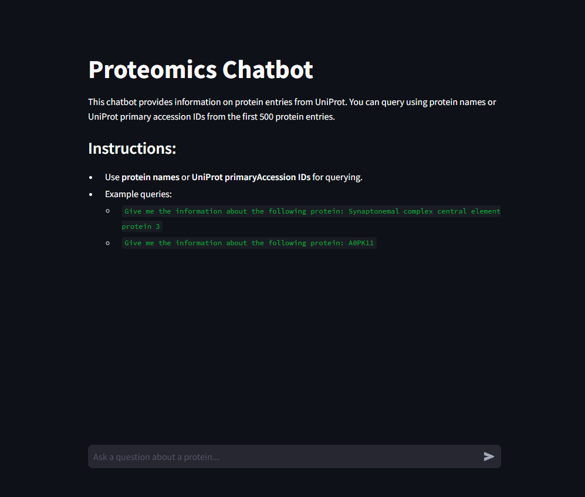

# **Proteomics Chatbot**

The **Proteomics Chatbot** is an AI-powered application that uses **Llama 3.1** to provide accurate and contextual information about proteins. It leverages the UniProt database for protein-related data and supports conversational queries with the ability to handle follow-up questions. 

---
## **System Architecture**

## **Features**
- Retrieve protein information by querying the UniProt database.
- Interactive chatbot interface using **Streamlit**.
- Multiple system setup for Experimental study
---

## **Technologies Used**
- **Python** (v3.8 or higher)
- **Streamlit** (for the chatbot GUI)
- **ProtTrans** (for encoding protein data)
- **FAISS** (for indexing and retrieval)
- **Ollama** (for providing Llama3)
- **LangChain** (for conversational logic)
- **UniProt API** (for fetching protein data)

---

## **Installation Guide**

### **1. Prerequisites**
- Python 3.8 or higher
- Ollama
- Docker (optional for containerization)

### **2. Clone the Repository**
```bash
git clone https://github.com/Dipeshtripathi13/proteomics_chatbot.git
cd proteomics_chatbot
```

### **3. Set Up a Virtual Environment**
```
python -m venv .venv
.venv\Scripts\activate     # For Windows
```

### **4. Install Dependencies**
```
pip install -r requirements.txt
```
### **5. Install Ollama**
Download and install Ollama from [here](https://ollama.com/download)
```
ollama pull llama3.2:1b
ollama run llama3.2:1b
```
## **Usage**

### Run the Chatbot**
Start the Streamlit chatbot application: (make sure ollama is running)
```
streamlit run app.py
```
Open your browser and navigate to the provided URL (e.g., `http://localhost:8501`).

---

## **Project Structure**
```
proteomics_chatbot/
│
├── app.py                       # Streamlit GUI for the chatbot
├── model_load.py                # Core logic for fetching and processing protein data
├── vectorize_protoindex.py      # Script for encoding and indexing protein data
├── retrive_protoindex.py        # Script for query-based retrieval from FAISS
├── requirements.txt             # List of dependencies
├── README.md                    # Project documentation
├── uniprot_data.csv             # Protein data file
├── response_process.py          # Preprocessing logic for protein data
├── Dockerfile                   # Docker containerization instructions
├── get_selected_data.py         # To extract the top 5oo records from the uniport database
├── extract_index.py             # To vectorize each of the 500 records using sentence Transfomer
├── protein_info_vectors.index   # stored vector index of each of the records
├── vectorizer.py                # Generate vector index of each of the records
```

---

## **API Integration**
The chatbot fetches real-time protein data from the UniProt database using their REST API. Example endpoint:
```plaintext
https://rest.uniprot.org/uniprotkb/{protein_id}
```

---

## **Containerization (Optional)**

### **1. Build the Docker Image**
Ensure Docker is installed and running. Then, build the Docker image:
```
docker build -t proteomics-chatbot .
```

### **2. Run the Docker Container**
Start the application in a Docker container:
```
docker run -p 8501:8501 proteomics-chatbot
```

Access the chatbot at `http://localhost:8501`.

---

## **Application Screenshot**



---

## **Contributing**
We welcome contributions! Please fork the repository, make your changes, and submit a pull request.

---


---

## **Acknowledgments**
- [UniProt](https://www.uniprot.org/) for the protein database.
- [ProtTrans](https://github.com/agemagician/ProtTrans) for protein sequence embeddings.
- [Streamlit](https://streamlit.io/) for the interactive interface.
- [FAISS](https://github.com/facebookresearch/faiss) for efficient similarity search.
- Ollama for providing Llama3

---
